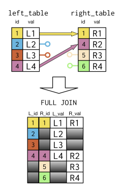

# Outer Joins

Outer joins are subdivided into three types:

* `Left outer join` - retain all rows from the left table, plus all matching rows from the right table
* `Right outer join` - retain all rows from the right table, plus matching rows from the left table.
* `Full outer join` - retain all rows from both tables - **union** (the order of the tables matters)

For rows that do not occur in both tables, missing values will appear in the combined table.

In contrast to an inner join:

* `Inner join` - retains rows that are common to both tables.




```sql
-- INNER JOIN
SELECT left_table.id AS L_id, left_table.val AS L_val, right_table.val AS R_val
FROM left_table
    INNER JOIN right_table
        USING (id);

-- LEFT JOIN
SELECT left_table.id AS L_id, left_table.val AS L_val, right_table.val AS R_val
FROM left_table
    LEFT JOIN right_table
        USING (id);

-- RIGHT JOIN
SELECT right_table.id AS R_id, left_table.val AS L_val, right_table.val AS R_val
FROM left_table
    RIGHT JOIN right_table
        USING (id);

-- FULL JOIN
SELECT left_table.id AS L_id, right_table.id AS R_id, left_table.val AS L_val, right_table.val AS R_val
FROM left_table
    FULL JOIN right_table
        USING (id);
```

```sql
SELECT c.name AS country, local_name, l.name AS language, percent
-- 1. From left table (alias as c)
FROM countries AS c
  -- 2. Join to right table (alias as l)
  LEFT JOIN languages AS l
    -- 3. Match on fields
    ON c.code = l.code
    -- 4. Order by descending country
ORDER BY country DESC;

-- use AVG() in combination with left join to determine the average gross domestic product (GDP) per capita by region in 2010.
-- Select fields
SELECT region, AVG(gdp_percapita) AS avg_gdp
-- From countries (alias as c)
FROM countries c
  -- Left join with economies (alias as e)
  LEFT JOIN economies AS e
    -- Match on code fields
    ON c.code = e.code
-- Focus on 2010
WHERE year = 2010
-- Group by region
GROUP BY region
-- Order by descending avg_gdp
ORDER BY avg_gdp DESC;
```

```sql
-- convert this code to use RIGHT JOINs instead of LEFT JOINs
SELECT cities.name AS city, urbanarea_pop, countries.name AS country,
       indep_year, languages.name AS language, percent
FROM cities
  LEFT JOIN countries
    ON cities.country_code = countries.code
  LEFT JOIN languages
    ON countries.code = languages.code
ORDER BY city, language;


SELECT cities.name AS city, urbanarea_pop, countries.name AS country,
       indep_year, languages.name AS language, percent
FROM languages
  RIGHT JOIN countries
    ON languages.code = countries.code
  RIGHT JOIN cities
    ON countries.code = cities.country_code
ORDER BY city, language;
```

```sql
-- FULL JOIN
SELECT name AS country, code, region, basic_unit
-- 3. From countries
FROM countries
  -- 4. Join to currencies
  FULL JOIN currencies
    -- 5. Match on code
    USING (code)
-- 1. Where region is North America or null
WHERE region = 'North America' OR region IS NULL
-- 2. Order by region
ORDER BY region;

-- LEFT JOIN (compare result)
SELECT name AS country, code, region, basic_unit
-- 1. From countries
FROM countries
  -- 2. Join to currencies
  LEFT JOIN currencies
    -- 3. Match on code
    USING (code)
-- 4. Where region is North America or null
WHERE region = 'North America' OR region IS NULL
-- 5. Order by region
ORDER BY region;

-- INNER JOIN (compare result)
SELECT name AS country, code, region, basic_unit
FROM countries
  -- 1. Join to currencies
  INNER JOIN currencies
    USING (code)
-- 2. Where region is North America or null
WHERE region = 'North America' OR region IS NULL
-- 3. Order by region
ORDER BY region;
```

The FULL JOIN query returned 17 rows, the LEFT JOIN returned 4 rows, and the INNER JOIN only returned 3 rows.

```sql
-- FULLL JOIN
SELECT countries.name, code, languages.name AS language
-- 3. From languages
FROM languages
  -- 4. Join to countries
  FULL JOIN countries
    -- 5. Match on code
    USING (code)
-- 1. Where countries.name starts with V or is null
WHERE countries.name LIKE 'V%' OR countries.name IS NULL
-- 2. Order by ascending countries.name
ORDER BY countries.name;

-- LEFT JOIN (compare result)
SELECT countries.name, code, languages.name AS language
FROM languages
  -- 1. Join to countries
  LEFT JOIN countries
    -- 2. Match using code
    USING (code)
-- 3. Where countries.name starts with V or is null
WHERE countries.name LIKE 'V%' OR countries.name IS NULL
ORDER BY countries.name;

-- INNER JOIN (compare result)
SELECT countries.name, code, languages.name AS language
FROM languages
  -- 1. Join to countries
  INNER JOIN countries
    USING (code)
-- 2. Where countries.name starts with V or is null
WHERE countries.name LIKE 'V%' OR countries.name IS NULL
ORDER BY countries.name;
```

The FULL JOIN query returned 53 rows, the LEFT JOIN returned 51 rows, and the INNER JOIN only returned 10 rows.

We'll use two `FULL JOINS` on three tables

```sql
SELECT c1.name AS country, region, l.name AS language, basic_unit, frac_unit
-- 1. From countries (alias as c1)
FROM countries AS c1
  -- 2. Join with languages (alias as l)
  FULL JOIN languages AS l
    -- 3. Match on code
    USING (code)
  -- 4. Join with currencies (alias as c2)
  FULL JOIN currencies AS c2
    -- 5. Match on code
    USING (code)
-- 6. Where region like Melanesia and Micronesia
WHERE region LIKE 'M%nesia';
```

**CROSS JOINS**

Create all possible combinations of two tables. Cross joins do not use `ON` or `USING`.


```sql
-- languages potentially and most frequently spoken in the cities of Hyderabad, India and Hyderabad, Pakistan
SELECT c.name AS city, l.name AS language
-- 1. From cities (alias as c)
FROM cities AS c        
  -- 2. Join to languages (alias as l)
  CROSS JOIN languages AS l
-- 3. Where c.name like Hyderabad
WHERE c.name LIKE 'Hyder%';

-- using an INNER JOIN
SELECT c.name AS city, l.name AS language
-- 1. From cities (alias as c)
FROM cities AS c      
  -- 2. Join to languages (alias as l)
  INNER JOIN languages AS l
    -- 3. Match on country code
    ON c.country_code = l.code
-- 4. Where c.name like Hyderabad
WHERE c.name LIKE 'Hyder%';

-- In terms of life expectancy for 2010, determine the names of the lowest five countries and their regions
SELECT c.name AS country, region, p.life_expectancy AS life_exp
-- From countries (alias as c)
FROM countries AS c
  -- Join to populations (alias as p)
  LEFT JOIN populations AS p
    -- Match on country code
    ON c.code = p.country_code
-- Focus on 2010
WHERE year = 2010
-- Order by life_exp
ORDER BY life_exp
-- Limit to 5 records
LIMIT 5;
```