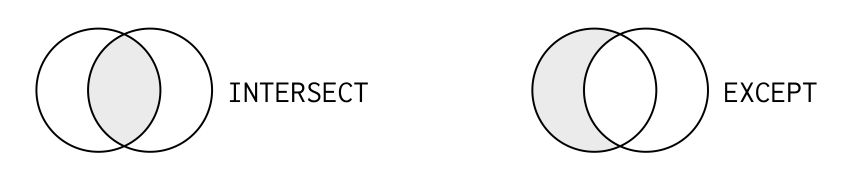

# Set Theory Clauses

## Union Clauses


 

Union and union all stack the two tables being joined:

* **Union** includes every record in both tables, but does not 'double count' those that are in both tables, e.g. `id` 1 and 4 are included from the left table, bu ignored from the right.
* **Union All** includes every record from both tables. This is why the intersection of the union-all set diagram is darker.

Using union and union all on the `prime_ministers` and `monarchs` tables:

```sql
-- Union
SELECT prime_minister AS leader, country
FROM prime_ministers
UNION -- set operation to perform
SELECT monarch, country
FROM monarchs
ORDER BY country;

-- Union All
SELECT prime_minister AS leader, country
FROM prime_ministers
UNION ALL
SELECT monarch, country
FROM monarchs
ORDER BY country
LIMIT 10;
```

Note:

Since the two tables are being 'stacked':

- Each SELECT statement within UNION must have the same number of columns, e.g. leader and country vs monarch and country
- The columns must also have similar data types, e.g. leader and monarch
- The columns in each SELECT statement must also be in the same order

```sql
-- combine two economies tables, containiing all the fields from economies2010
SELECT code, year, income_group, gross_savings
  FROM economies2010
	UNION
SELECT code, year, income_group, gross_savings
  FROM economies2015
ORDER BY code, year;

-- Determine all (non-duplicated) country codes in either the cities or the currencies table. 
-- The result should be a table with only one field called country_code.
SELECT country_code
  FROM cities
	UNION
SELECT code AS country_code
  FROM currencies
ORDER BY country_code;

-- Determine all combinations (include duplicates) of country code and year that exist in either 
-- the economies or the populations tables. Order by code then year. ==> 814 rows
SELECT code, year
  FROM economies
	UNION ALL
SELECT country_code AS code, year
  FROM populations
ORDER BY code, year;
```

## Intersect/Except Clauses




Intersect and except 'stack' the tables being joined, but select a subset of data from the two tables.

* **Intersect** includes only those records that are found in both tables.
* **Except** includes only those records found in one of the tables, but not the other.

```sql
SELECT id
FROM left_one
INTERSECT
SELECT id
FROM right_one;

-- find the countries with both a prime miniter and president
SELECT country
FROM prime_ministers
INTERSECT
SELECT country
FROM presidents
```

Intersect looks for records in common, matches on the actual values in the fields, not the key fields as a join. 

```sql
-- find countries in both tables with a matching prime minister and president ==> result NONE
-- there were not any prime ministers or presidents in both tables with the same name
SELECT country, prime_minister AS leader
FROM prime_ministers
INTERSECT
SELECT country, president
FROM presidents;

-- find the records in common for country code and year for the economies and populations tables. ==> 380 rows
SELECT code, year
  FROM economies
	INTERSECT
SELECT country_code AS code, year
  FROM populations
ORDER BY code, year;

--  which countries also have a city with the same name as their country name?
SELECT name
  FROM countries
	INTERSECT
SELECT name
  FROM cities;
```

```sql
-- look for monarchs who are not also prime ministers
SELECT monarch, country
FROM monarchs -- only 
EXCEPT
SELECT prime_minister, country
FROM prime_ministers;

-- Get the names of cities in cities which are not noted as capital cities in countries
SELECT name
  FROM cities
	EXCEPT
SELECT capital
  FROM countries
ORDER BY name;

-- Determine the names of capital cities that are not listed in the cities table (opposite of above).
SELECT capital
  FROM countries
	EXCEPT
SELECT name
  FROM cities
ORDER BY capital;
```